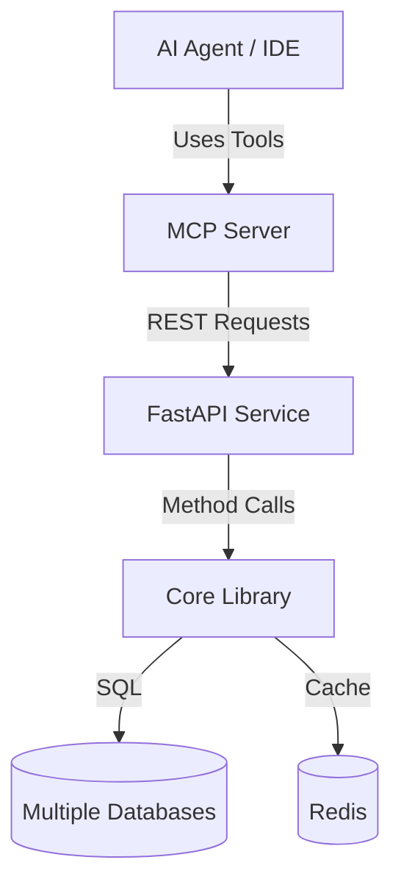

# Multi-DB Describer

**Multi-DB Describer** is an open-source toolset designed to provide a unified, standardized way to introspect and describe various database systems. Whether you are building a data catalog, a database administration tool, or integrating database knowledge into AI agents, this project offers a modular architecture to bridge the gap between different database engines.

> [!CAUTION]
> **Status: Alpha**
> This project is currently in an alpha state. APIs and internal structures are subject to change. It is open for use and contribution, but should be handled with care in production environments.

---

## Project Structure & Architecture

The project is divided into three main components, each serving a specific layer of the stack:

### 1. [Core](./core) (The Engine)
The `core` is a Python library that acts as the fundamental abstraction layer.
- **Purpose**: Provides a unified interface (`BaseConnector`) to interact with different databases (MySQL, SQLite, DuckDB, and more to come).
- **Key Features**: 
    - Pydantic models for database metadata (Instances, Schemas, Tables, Columns).
    - Built-in Redis caching to optimize introspection performance.
    - Extensible architecture to easily add new database connectors.

### 2. [API](./api) (The Service)
A high-performance REST API built with **FastAPI** that wraps the `core` library.
- **Purpose**: Exposes the database introspection logic over HTTP, making it accessible to any language or platform.
- **Key Features**:
    - Endpoints for listing configurations, instances, schemas, and tables.
    - Support for multiple response formats, including standard JSON and **TOON** (Tree-Oriented Object Notation) for efficient data representation.
    - Integrated with the `core` caching layer.

### 3. [MCP](./mcp) (The AI Bridge)
An implementation of the **Model Context Protocol (MCP)** using `fastmcp`.
- **Purpose**: Acts as a bridge between Large Language Models (LLMs) and the Multi-DB Describer API.
- **Key Features**:
    - Translates API endpoints into "tools" that AI agents (like Gemini, Claude, or IDE-integrated assistants) can understand and execute.
    - Allows AI agents to autonomously explore database structures to better assist users with queries, documentation, or analysis.

---

## How They Connect

The components are designed to work together in a tiered architecture:

1.  **Core** is imported and used by the **API**.
2.  **API** runs as a standalone service (optionally in Docker) and handles the actual database connections.
3.  **MCP** runs as a client/bridge that talks to the **API** and exposes its capabilities to **MCP-compliant LLM clients**.

---

## Getting Started

Each subproject contains its own `README.md` with specific installation and configuration instructions:

- To use it as a library in your Python project, see [Core Setup](./core/README.md).
- To deploy the introspection service, see [API Setup](./api/README.md).
- To enable AI agent integration, see [MCP Setup](./mcp/README.md).

---

## Contributing

We welcome contributions! As an alpha project, there are many ways to help:
- Implementing new connectors (Postgres, Presto, Snowflake, etc.).
- Improving the TOON serialization format.
- Adding more comprehensive test suites.
- Enhancing documentation.

## License

This project is licensed under the [Apache License 2.0](LICENSE).
